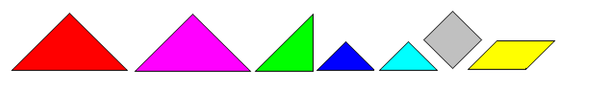
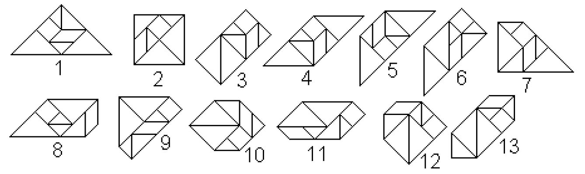
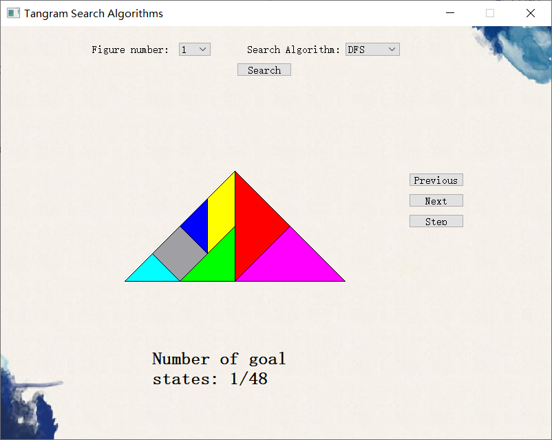
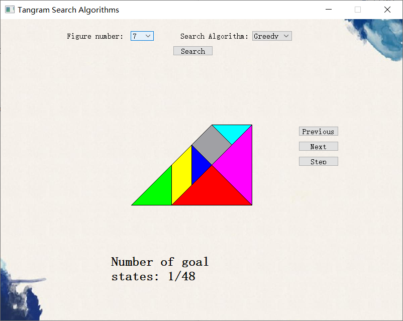

# **Tangram Pieces Matching and Recognition**

## Author

* Yichu Li
* Hongbo Wang

## **Environment:**

* C++
* Qt Creator
* Windows 10

## Description:

 Tangram is one of the most popular games to play with. You put figures of 7 pieces together (five triangles, one square and one parallelogram).

In this project, We used AI search methods (uninformed search methods and Informed or heuristic search methods to **perform pattern matching and recognition** for all the 13 convex figures that we can build from all the seven tangram pieces:

## **Display:**

1. 

   

2. 

   

3. 
   

   

